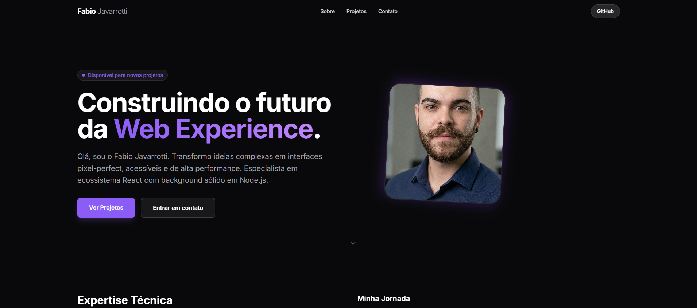

# 🚀 Portfólio Profissional (2025 Edition)

> Um portfólio moderno, responsivo e de alta performance desenvolvido para demonstrar expertise em Front-end Engineering e UI/UX.

 
https://meu-portfolio-henna.vercel.app/

## ✨ Funcionalidades

- **💎 Design Moderno:** Estética "Dark SaaS" com Tailwind CSS, focada em tipografia e espaçamento.
- **⚡ Performance Extrema:** Construído com Vite + React, carregamento instantâneo.
- **⌨️ Command Menu (Ctrl+K):** Navegação rápida estilo VSCode/Spotlight acessível via teclado.
- **📱 Mobile First:** Layout totalmente responsivo e adaptável a qualquer dispositivo.
- **🎨 UI Interativa:** Micro-interações com Framer Motion e cards com efeitos de hover.
- **♿ Acessibilidade:** Foco gerenciado, contraste adequado e HTML semântico.

## 🛠️ Stack Tecnológica

Este projeto utiliza as ferramentas mais atuais do mercado (Standard 2025):

- **Core:** [React 18](https://react.dev/) + [Vite](https://vitejs.dev/)
- **Linguagem:** [TypeScript](https://www.typescriptlang.org/)
- **Estilização:** [Tailwind CSS v3](https://tailwindcss.com/)
- **Ícones:** [Lucide React](https://lucide.dev/)
- **Animações:** [Framer Motion](https://www.framer.com/motion/)
- **Utils:** `clsx` e `tailwind-merge` para classes condicionais.

## 🚀 Como rodar localmente

Siga os passos abaixo para clonar e executar o projeto na sua máquina:

### Pré-requisitos
- Node.js (versão 18 ou superior) instalado.

### Passo a passo

1. **Clone o repositório**
   ```bash
   git clone [https://github.com/Fabferna/meu-portfolio.git](https://github.com/Fabferna/meu-portfolio.git)
   cd meu-portfolio
Instale as dependências

Bash

npm install
Inicie o servidor de desenvolvimento

Bash

npm run dev
Acesse no navegador O projeto estará rodando em http://localhost:5173

📦 Como fazer Deploy
Este projeto é otimizado para deploy na Vercel ou GitHub Pages.

Vercel (Recomendado)
Crie uma conta na Vercel.

Importe este repositório do GitHub.

A Vercel detectará o Vite automaticamente. Clique em Deploy.

📂 Estrutura de Pastas
Plaintext

src/
├── components/      # Componentes React modularizados
│   ├── features/    # Funcionalidades complexas (CommandMenu, ProjectCard)
│   └── ui/          # Elementos de UI reutilizáveis (Badge, Buttons)
├── data/            # Dados estáticos (textos, links, projetos)
├── lib/             # Utilitários e helpers
└── App.tsx          # Componente principal e Layout
📄 Licença
Este projeto está sob a licença MIT. Sinta-se à vontade para usar como inspiração.

<div align="center"> Desenvolvido com 💜 por <a href="https://www.linkedin.com/in/fabio-javarrotti-372172120/" target="_blank">Fabio Javarrotti</a> </div>


### Dica Extra (Opcional):

No README eu coloquei uma referência a uma imagem `preview-cover.png`. Se você quiser deixar seu GitHub **muito bonito**, tire um print da tela inicial do seu site funcionando, salve com esse nome dentro de `public/assets/` e suba para o GitHub. Assim, quem entrar no seu repositório já vê a cara do site de primeira\!
